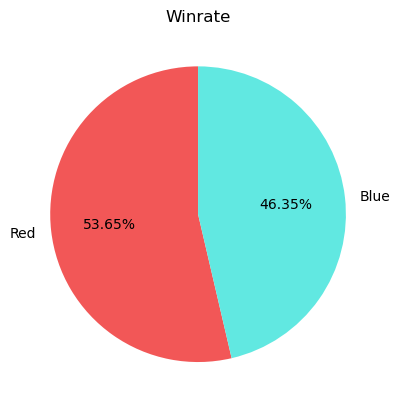
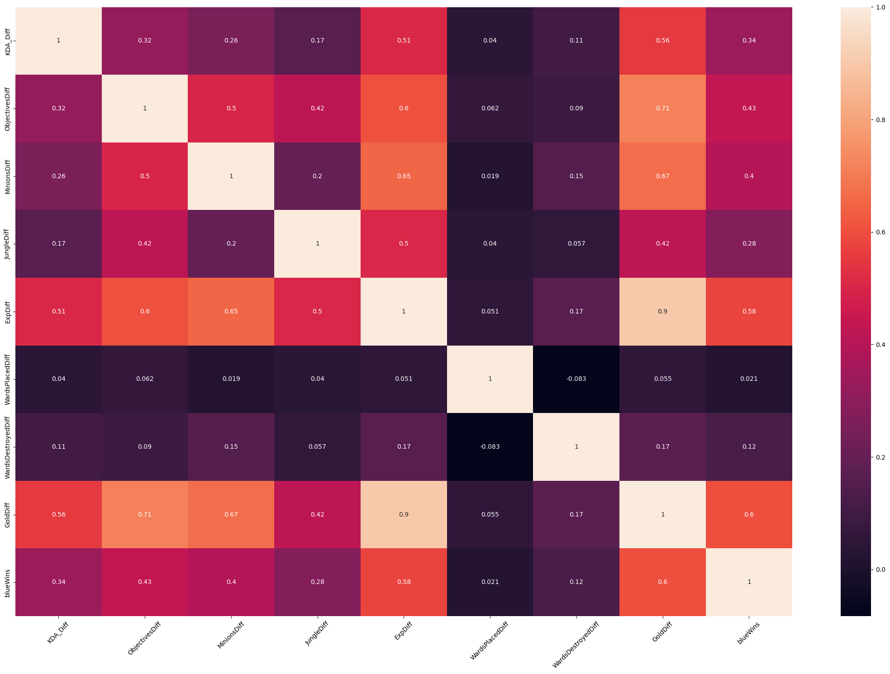

Last updated: 25/06/2024

Patch version: 14.11

Sever: Korea
# LOL-V2
This is my personal project about League of Legends and is an improved version from the previous ones as I will be doing the data gathering by myself using the Riot API. The main goal of this project is to analyze the data and create a model that can predict the outcome of a match based on the data gathered.

# Reason
League of Legends is a game that I have been playing for a long time (approximately ~ 10 years) and I have always been interested in the data that the game provides. I have always wanted to create a model that can predict the outcome of a match based on the data that the game provides. This project is a way for me to learn more about data analysis and machine learning.

Although there were already some datasets available online, this is still an online game. Hence, the data is constantly changing and I wanted to have the most up-to-date data possible. This is why I decided to gather the data myself using the Riot API. 

With that being said, I'm sure that my data will be obsolete in a few months, but I will still want to give it a try.

# Data Gathering
In this project, I will be only using data from the highest tier of the game, which is Challenger, Grandmaster and Master.

## encryptedSummonerID
The first step is to get the encryptedsummonerID of the players in the highest tier. As of right now, there are about 300 players in the Challenger tier, 700 players in the Grandmaster tier and about 8000 players in Master tier. I will be using the Riot API to get the encryptedsummonerID of these players using this [API](https://developer.riotgames.com/apis#league-exp-v4). We ended up with 7941 summonerIDs.
## PUUID
After getting the encryptedsummonerID, I will be using this [API](https://developer.riotgames.com/apis#summoner-v4) to get their respective PUUID.

## Match History
Next up, for each of these PUUIDs, we will be getting their match history using this [API](https://developer.riotgames.com/apis#match-v5/GET_getMatchIdsByPUUID) to get their latest 100 matches.

## Match Data
Because we are aiming for 15 minutes of data, we need to get the specific details of each match. We will be using this [API](https://developer.riotgames.com/apis#match-v5/GET_getTimeline) to get the data of each match.

## Notes
During the API calls, there were some matches that were not found in the database but still got returned somehow. Apparently, this is a known issue and Riot Games developer has said that they will not be fixing this [issue](https://github.com/RiotGames/developer-relations/issues/807) so we will just have to remove it during the API call.
# Features
| **Names** | **Description** | Notes |
| --- | --- | --- |
| blueWins| Whether the blue team won or not |  |
| firstBlood | First kill in the game | Both |
| Kills | Total kills in the game | Both |
| Deaths | Total deaths in the game | Both |
| Assists | Total assists in the game | Both |
| WardsPlaced | Total wards placed in the game | Both |
| WardsDestroyed | Total wards destroyed in the game | Both | 
| ControlWardsPlaced | Total control wards placed in the game | Both |
| ControlWardsDestroyed | Total control wards destroyed in the game | Both | 
| Dragons | Total dragons a team secured in the game | Both |
| Herald | Whether a team secured a herald in the game | Both | 
| Void Grubs | Total void grubs a team secured in the game | Both |
| TowersDestroyed | Total towers destroyed in the game | Both |
| PlatesDestroyed | Total plates destroyed in the game | Both |
| TotalGold | Total gold at 15th minute | Both |
| TotalExperience | Total experience at 15th minute | Both |
| TotalMinionsKilled | Total minions killed at 15th minute | Both | 
| TotalJungleMinionsKilled | Total jungle minions killed at 15th minute | Both | 
| FirstTurret | Whether a team secured the first turret in the game | Both |
| InhibitorsDestroyed | Total inhibitors destroyed in the game | Both |
| FirstDragon | Whether a team secured the first dragon in the game | Both |
| gameDuration | Game length in seconds | |

*Notes*: Both means that there will be 2 seperate features for the feature, both for blue and red.

During the matches history crawling, there were some matches that were not a ranked game but stil got returned in the response. We will solve this by making another request using this [API](https://developer.riotgames.com/apis#match-v5/GET_getMatch) to get the type of game before fetching the match data. Also, since there are only around 7000 players in the highest tier ( 7338 approximately), we will have around 733800 matches to work with, but there will be some duplicates because some players will be in the same match and there will be players who haven't played 100 matches yet so the actual number of matches will be less than that.

# Completed Data
After running all the scripts to gather the summonerID, PUUID, matchID, we ended up with 105164 matches. With the current API limit, it would take us approximately 35 hours to get the detail of each match. Therefore, I came up with an idea to split the data into 4 parts and using 4 different API keys to get the data. This way, we can get the data in 10 hours, given that we will have 3 batches with 30000 matches and 1 batch with 15164 matches. After about 1 days, because I was having network problems, some scripts were accidentally stopped while I was sleeping, we got 94356 matches. This is the final data that we will be working with.

# Data Cleaning
At first look, I noticed that there were some columns that should not be zero, e.g blue and red jungle minions under no circumstances should be zero. I will be removing these rows from the dataset.  Apart from that, everything looks completely fine to me.

# Data Visualization

Winrate




Before moving on the the heatmap, I would like to point out some of the features we will be using for our Machine Learning model. 

| **Names** | **Description** | **How to calculate**  |
| --- | --- | --- |
| KDA_Diff | Kill Death Assist | blueKDA - redKDA |
| WardsPlaced_Diff | Wards Placed | blueWardsPlaced - redWardsPlaced |
| WardsDestroyed_Diff | Wards Destroyed | blueWardsDestroyed - redWardsDestroyed |
| ObjectivesDiff | Objectives | blueDragons + blueHerald + blueTowersDestroyed + bluePlatesDestroyed + blueInhibitorsDestroyed - redDragons - redHerald - redTowersDestroyed - redPlatesDestroyed - redInhibitorsDestroyed |
| MinionsDiff | Minions | blueTotalMinionsKilled - redTotalMinionsKilled |
| JungleDiff | Jungle Minions | blueTotalJungleMinionsKilled - redTotalJungleMinionsKilled |
| GoldDiff | Gold | blueTotalGold - redTotalGold |
| ExpDiff | Experience | blueTotalExperience - redTotalExperience |

And the heatmap:



# Machine Learning
For this section, I will be using 70% for training and 30% for testing and the following models:

1. Logistic Regression
2. Random Forest
3. SGD Classifier
4. Neural Network with 1 hidden layers and use GridSearchCV to find the best parameters.


# Results
| **Model** | **Accuracy** | 
| --- | --- |
| Logistic Regression | 0.7803 |
| Random Forest | 0.7783 |
| SGD Classifier | 0.7803 |

For the Neural Network, these are the parameters grid that were used during the GridSearchCV:

| Batch Size | Epochs | Optimizer | Neurons | Activation |
| --- | --- | --- | --- | --- |
| 20 | 100 | Adam | 32 | relu |
| 50 | 1000 | SGD |  64 | sigmoid |
| 100 | 10000 | | 128 | |

That is 108 models to be fitted and after 1 whole day of training, this is the best model with the accuracy of `0.7805`:

```
{'activation': 'sigmoid', 'batch_size': 50, 'epochs': 1000, 'neurons': 32, 'optimizer': 'SGD'}
```

# Reference
This project is inspired by [artoria-dev](https://github.com/artoria-dev/data-science-lol). I highly recommend you check out his project as the markdown there is really well written and the project is really well done.